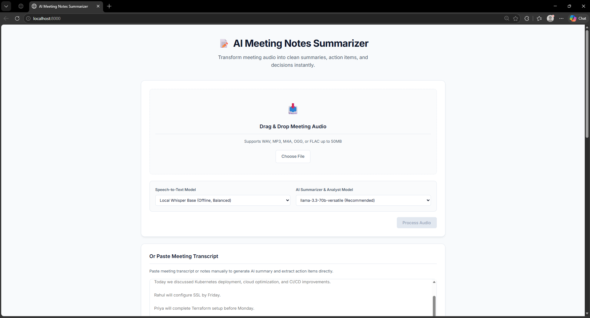

# 📝 AI Meeting Notes Summarizer

<p align="center">
  
  
  
  
  
  
  
  
</p>

<p align="center">
  <strong>An enterprise-grade, asynchronous full-stack application designed to transcribe conversational audio, perform parallel analytical summarization, extract structured deliverables, and index meetings into relational and high-dimensional vector databases. Now fully packaged for modern containerized cloud workflows.</strong>
</p>

---

## 📖 Table of Contents

- [1. Executive Summary & Value Proposition](#1-executive-summary--value-proposition)
- [2. Core Features](#2-core-features)
- [3. Architectural Design & System Flow](#3-architectural-design--system-flow)
- [4. Processing Pipeline Workflow](#4-processing-pipeline-workflow)
- [5. Technical Stack Specifications](#5-technical-stack-specifications)
- [6. Directory Architecture](#6-directory-architecture)
- [7. Local Quick-Start & Installation Guide](#7-local-quick-start--installation-guide)
- [8. Docker Setup & Composition](#8-docker-setup--composition)
- [9. KIND Cluster Architecture & Setup](#9-kind-cluster-architecture--setup)
- [10. Kubernetes Manifest Deployments](#10-kubernetes-manifest-deployments)
- [11. CI/CD GitHub Actions Workflow](#11-cicd-github-actions-workflow)
- [12. Environmental Configurations](#12-environmental-configurations)
- [13. API Documentation](#13-api-documentation)
- [14. Git Branching Workflow & DevOps Standard](#14-git-branching-workflow--devops-standard)
- [15. Application Visual Previews](#15-application-visual-previews)
- [16. License](#16-license)

---

## 1. Executive Summary & Value Proposition

In modern corporate operational structures, post-meeting administrative tasks introduce significant friction. The **AI Meeting Notes Summarizer** is designed to address this inefficiency by automating the lifecycle of conversational data.

### 🚨 The Problem Statement
During typical business operational cycles, organizations encounter three primary bottlenecks:
1. **High Administrative Overhead**: Valuable engineering and managerial hours are lost manually compiling, editing, and formatting meeting minutes and distributing task notes.
2. **Action Item Decay & Ambiguity**: Deliverables, deadlines, and ownership assignments agreed upon verbally are frequently forgotten, misremembered, or lost, creating execution gaps.
3. **Siloed & Unsearchable Conversational Assets**: Historical decision contexts and meeting recordings remain locked in flat files or unindexed audio binaries, rendering organizational knowledge unsearchable.

### 💡 The Solution
This application introduces a unified **Asynchronous Processing Pipeline** that immediately converts verbal files or text transcripts into organized corporate database structures:
*   **Automatic Transcription & Parallel Analysis**: Instantly transcribes voice streams or processes text inputs, deploying parallel LLM chains to extract summaries, checklists, and decisions in seconds.
*   **Relational Action Checklist (MySQL)**: Commits meetings and structures tasks into an active checklist to ensure absolute delivery accountability.
*   **Semantic Retrieval Storage (ChromaDB)**: Chunks, encodes, and indexes transcripts into a persistent vector index, enabling instantaneous context retrieval for future semantic question-answering.

---

## 2. Core Features

*   **Dual-Track Processing Modes**:
    *   *Option 1 (Audio Stream)*: Transcribe raw speech files (`WAV`, `MP3`, `M4A`, `OGG`, `FLAC` up to 50MB) using Whisper STT.
    *   *Option 2 (Direct Transcript)*: Paste raw meeting text directly to bypass speech-to-text, providing immediate test capability and raw analytical processing.
*   **Speech-to-Text Layer**: Run local, offline OpenAI Whisper (`base`/`tiny` weights running efficiently on CPU) or configure Groq cloud-based Whisper APIs.
*   **Modern AI Analysis (LCEL)**: Built on parallel LangChain Expression Language (LCEL) chains connected to high-performance inference models via Groq API.
*   **Action & Decision Engines**: Intelligent regex parsing and named-entity extraction to structure deliverables, complete with assignees and checkboxes.
*   **Production DevOps Infrastructure**: Out-of-the-box support for multi-stage Docker builds, Kubernetes manifests, KIND multi-node clusters, and automated GitHub Actions CI/CD workflows.

---

## 3. Architectural Design & System Flow

The system employs a clean, modular full-stack architecture separating the client interface from the backend RESTful service layer:

```text
                                  +---------------------------------------+
                                  |            CLIENT INTERFACE           |
                                  |     (HTML5, CSS3, ES6 JavaScript)     |
                                  +---------+-------------------+---------+
                                            |                   |
                                Audio Stream | Form-Data         | Pasted Text
                                             v                   v
                                  +---------------------------------------+
                                  |         FASTAPI APP GATEWAY           |
                                  |           (REST Router, CORS)         |
                                  +---------+-------------------+---------+
                                            |                   |
                                     If Audio |                   | If Text / Direct
                                              v                   v
  +-------------------------------------------+---+   +-----------+-----------------------+
  |          SPEECH-TO-TEXT MACHINE           |   |       LANGCHAIN INFERENCE PIPES       |
  |    (OpenAI Whisper Local / Cloud Engine)  |   |  (Parallel LCEL Extraction Chains)    |
  +-------------------------------------------+---+   +-----------+-----------------------+
                                              |                   |
                                              +-------------------+
                                                                  |
                                                                  v
                                                [ Highly Structured JSON Outcome ]
                                                                  |
                                    +-----------------------------+-----------------------------+
                                    |                                                           |
                                    v                                                           v
                       +----------------------------+                              +----------------------------+
                       |    MYSQL TRANSACTION DB    |                              |     CHROMADB VECTOR DB     |
                       | (Relational Checklist Core)|                              |  (Sentence-Transformer L6) |
                       +----------------------------+                              +----------------------------+
```

---

## 4. Processing Pipeline Workflow

The execution pipeline transforms input data through eight distinct processing states:

```text
[1. Submission] ==> [2. Validation] ==> [3. STT Engine] ==> [4. LCEL Pipeline]
   (Audio/Text)      (Headers/Sizes)      (Whisper CPU)      (Parallel Chains)
                                                                     |
                                                                     v
[8. DOM Render] <== [7. Chroma Index] <== [6. MySQL Save] <== [5. Inference]
  (Dynamic UI)       (Dense Vectors)      (Transactional)     (Structured JSON)
```

1.  **Ingestion**: Client initiates request by sending an audio binary or plain text payload via multipart form-data.
2.  **Gatekeeping**: FastAPI middleware validates format extensions, boundaries, and safety configurations.
3.  **Transcription (Audio track only)**: Whisper converts audio data into structured raw sentences.
4.  **Prompt Routing**: Raw text is routed to parallel LangChain Expression Language pipelines.
5.  **LLM Analytical Inference**: Parallel chains execute to produce summaries, extract decisions, and compile deliverables.
6.  **Transactional Commit**: PyMySQL processes records and updates table spaces with transactional meeting IDs.
7.  **Vector Embedding**: Sentence-Transformers vectorizes paragraph-chunks and updates the Chroma collection.
8.  **DOM Rehydration**: JavaScript rehydrates the DOM, rendering active checklist elements.

---

## 5. Technical Stack Specifications

### Technology Core
| Tier | Technology | Selected Version | Rationale |
| :--- | :--- | :--- | :--- |
| **Frontend** | Pure HTML5 / CSS3 / ES6 | Native standards | Zero-dependency build footprint, maximized rendering speeds. |
| **Backend** | Python FastAPI / Uvicorn | `FastAPI 0.100+` | Asynchronous speed, Pydantic type safety, autogenerated Swagger. |
| **Orchestration** | LangChain Core / LCEL | `LangChain 1.3.1` | Modular pipe configurations (`|` operator), parallel runtime chains. |
| **Inference Core** | Groq Cloud API Client | `Groq 0.37+` | High-frequency inference execution speeds on LPU hardware. |
| **Speech-to-Text** | OpenAI Whisper (Local) | `Whisper 202506` | Offline CPU compliance, local cache capability. |
| **Relational DB** | MySQL Server | `MySQL 8.0` | Secure schemas, strict primary foreign key compliance, quick index reads. |
| **Vector DB** | ChromaDB Persistent Client | `ChromaDB 1.5.9` | In-process DB footprint, integrated sentence-transformer indexes. |
| **Containers** | Docker / Compose | Engine `20.10+` | Containerization of services to enforce cross-platform runtime equity. |
| **K8s Engine** | KIND (Kubernetes in Docker) | `v0.20+` | Micro-cluster provisioning targeting standard local development testing. |

---

## 6. Directory Architecture

```text
ai-meeting-summarizer/
├── frontend/
│   ├── index.html        # DOM architecture and typography interfaces
│   ├── style.css         # Minimalist, polished light-theme CSS variables
│   └── script.js         # RESTful integrations, DOM rehydration, & UX handlers
├── backend/
│   ├── main.py           # REST gateway, lifespan bindings, and CORS filters
│   ├── requirements.txt  # Explicitly locked library dependencies
│   ├── .env              # Critical environment values (Keys & SQL settings)
│   ├── database/
│   │   ├── mysql_db.py   # Transactional schemas, connection pool, and mutations
│   │   └── chroma_db.py  # Paragraph segmenters, transformers, and vector persistence
│   ├── services/
│   │   ├── transcription.py  # Local Whisper engines and cloud APIs wrappers
│   │   └── summarization.py  # Structured LangChain LCEL pipeline compilation
│   ├── uploads/          # Temporary directory for uploaded audio cache
│   └── vectorstore/      # Persistent local database storage for vector nodes
├── docker/
│   ├── backend.Dockerfile   # Multi-stage optimized builder & non-root runner
│   └── frontend.Dockerfile  # Optimized Alpine-Nginx static publisher
├── kubernetes/
│   ├── namespace.yaml
│   ├── configmap.yaml
│   ├── secrets.yaml
│   ├── mysql-pvc.yaml
│   ├── mysql-deployment.yaml
│   ├── mysql-service.yaml
│   ├── chromadb-pvc.yaml
│   ├── chromadb-deployment.yaml
│   ├── chromadb-service.yaml
│   ├── backend-deployment.yaml
│   ├── backend-service.yaml
│   ├── frontend-deployment.yaml
│   ├── frontend-service.yaml
│   └── ingress.yaml
├── .github/
│   └── workflows/
│       └── deploy.yml    # Full CI/CD building, pushing, & automated deployment
├── kind-config.yaml      # Multi-node local Kubernetes cluster definition
├── docker-compose.yml    # Root-level multi-container testing configuration
└── README.md
```

---

## 7. Local Quick-Start & Installation Guide

Ensure you have **Python 3.10+** and a running **MySQL Server** instance before starting.

### 1. Initialize Relational Storage
Create the transactional database inside your MySQL client:
```sql
CREATE DATABASE meeting_summarizer;
```

### 2. Configure Environment Configurations
Create a `.env` file in the `backend/` directory:
```env
GROQ_API_KEY=gsk_your_groq_api_key_here
DB_HOST=127.0.0.1
DB_PORT=3306
DB_USER=root
DB_PASSWORD=your_mysql_password
DB_NAME=meeting_summarizer
```

### 3. Establish Virtual Environment & Dependencies
```bash
# Navigate to the backend directory
cd backend

# Initialize Python virtual environment
python -m venv venv

# Activate venv (Windows PowerShell)
venv\Scripts\Activate.ps1

# Activate venv (Unix/macOS Bash)
source venv/bin/activate

# Install locked dependencies
pip install -r requirements.txt
```

### 4. Boot Application Server
```bash
uvicorn main:app --host 127.0.0.1 --port 8000 --reload
```
Navigate to: **`http://localhost:8000`**

---

## 8. Docker Setup & Composition

### Local Manual Building

To manually build service images locally:
```bash
# Build Backend multi-stage optimized image
docker build -t genai-backend:latest -f docker/backend.Dockerfile .

# Build Frontend web hosting image
docker build -t genai-frontend:latest -f docker/frontend.Dockerfile .
```

### Running with Docker Compose
To boot the full multi-tier production environment locally in a single command:
```bash
# Run composition in detached mode
docker-compose up -d

# Verify all services are online and healthy
docker-compose ps
```
The Frontend interface will be exposed on: **`http://localhost:8080`**.

---

## 9. KIND Cluster Architecture & Setup

We employ a local multinode cluster targeting production simulations.

### Cluster Topology Definition (`kind-config.yaml`)
- **1 Control Plane Node**: Matches system configuration parameters.
- **2 Worker Nodes**: Distributes service replication workloads.
- **Port Mapping**: Explicit routing for inbound Ingress calls.

### Initialize Cluster Setup
```bash
# Spin up the cluster using kind-config.yaml definition
kind create cluster --config kind-config.yaml --name genai-meeting-cluster

# Check cluster nodes
kubectl get nodes
```

### Load Docker Images directly to KIND
To bypass local registry constraints, you can load built images directly into KIND:
```bash
kind load docker-image genai-backend:latest --name genai-meeting-cluster
kind load docker-image genai-frontend:latest --name genai-meeting-cluster
```

---

## 10. Kubernetes Manifest Deployments

We provide structured, highly modularized manifests inside `kubernetes/` adhering to GitOps principles.

### Deploy All Cluster Manifests

Execute creation order to populate resources sequentially:
```bash
# 1. Apply Namespace
kubectl apply -f kubernetes/namespace.yaml

# 2. ConfigMaps & Secret Bindings
kubectl apply -f kubernetes/configmap.yaml
kubectl apply -f kubernetes/secrets.yaml

# 3. Persistent Storages
kubectl apply -f kubernetes/mysql-pvc.yaml
kubectl apply -f kubernetes/chromadb-pvc.yaml

# 4. Relational & Vector Deployments + Services
kubectl apply -f kubernetes/mysql-deployment.yaml
kubectl apply -f kubernetes/mysql-service.yaml
kubectl apply -f kubernetes/chromadb-deployment.yaml
kubectl apply -f kubernetes/chromadb-service.yaml

# 5. Core REST APIs & Frontend Web Deployments
kubectl apply -f kubernetes/backend-deployment.yaml
kubectl apply -f kubernetes/backend-service.yaml
kubectl apply -f kubernetes/frontend-deployment.yaml
kubectl apply -f kubernetes/frontend-service.yaml

# 6. Ingress Rules Gateway
kubectl apply -f kubernetes/ingress.yaml
```

### Install Nginx Ingress Controller on KIND
To enable Ingress path parsing on KIND:
```bash
kubectl apply -f https://raw.githubusercontent.com/kubernetes/ingress-nginx/main/deploy/static/provider/kind/deploy.yaml
```

### Status Verifications
```bash
# Inspect all pods within the namespace
kubectl get pods -n meeting-summarizer

# Check services
kubectl get svc -n meeting-summarizer

# Inspect Ingress settings
kubectl get ingress -n meeting-summarizer
```

---

## 11. CI/CD GitHub Actions Workflow

The automated deployment logic is managed via `.github/workflows/deploy.yml`.

### Continuous Integration (CI) Phase
1. **Source Checkout**: Imports the latest codebase branch.
2. **Environment Readying**: Provisions Python and initializes cached dependencies.
3. **Execution Verification**: Conducts code checks and automated tests.
4. **Multi-Stage Build**: Compiles both Frontend & Backend images.
5. **DockerHub Sync**: Publishes compiled image versions tagged with commit SHAs and `latest`.

### Continuous Deployment (CD) Phase
1. **Cluster Handshake**: Decodes `KUBE_CONFIG_DATA` to authenticate kubectl securely.
2. **Resource Updates**: Inserts fresh secrets, pulls correct image iterations, and executes resource application.
3. **Progress Tracking**: Tracks rollout statuses (`kubectl rollout status`) to guarantee absolute zero-downtime rehydration.

---

## 12. Environmental Configurations

The backend looks for these critical environment variables:

| Variable Name | Description | Default / Source |
| :--- | :--- | :--- |
| `GROQ_API_KEY` | Groq authorization token | Loaded from Secrets |
| `DB_HOST` | Host address of target MySQL server | `mysql-service` (Kubernetes) |
| `DB_PORT` | MySQL connection port | `3306` |
| `DB_USER` | MySQL authenticated user | `root` |
| `DB_PASSWORD` | Password matched to user record | Loaded from Secrets |
| `DB_NAME` | Active working SQL namespace | `meeting_summarizer` |
| `CHROMADB_HOST` | ChromaDB instance target | `chromadb-service` |
| `CHROMADB_PORT` | ChromaDB target REST port | `8000` |

---

## 13. API Documentation

### `POST /upload`
Processes a new meeting session audio or pasted markdown text records.

#### Content-Type: `multipart/form-data`

#### Multipart Form Elements:
- `file` (*Optional Binary*): Audio file (WAV, MP3, M4A, OGG, or FLAC).
- `transcript_text` (*Optional String*): Manually pasted meeting transcripts.
- `llm_model` (*String, default: "llama-3.3-70b-versatile"*): Analytics parser instance.
- `transcription_model` (*String, default: "local-whisper-base"*): Choice of model for speech transcription.

#### Response Output (`200 OK`)
```json
{
  "success": true,
  "id": 1,
  "title": "Board Sync notes",
  "transcript": "Today we discussed Kubernetes deployment...",
  "summary": "The team agreed to deploy to KIND cluster...",
  "decisions": "Approved transition to containerized setup.",
  "action_items": [
    "Rahul to configure SSL by Friday",
    "Priya to configure K8s manifests"
  ]
}
```

---

## 14. Git Branching Workflow & DevOps Standard

To contribute new additions to the DevOps configuration, follow this standard branch lifecycle:

### 1. Checkout a dedicated Feature Branch
```bash
git checkout -b cicd
```

### 2. Commit modifications
Ensure all configurations adhere to declarative parameters:
```bash
git add .
git commit -m "feat: implement complete multi-node KIND cluster, docker-compose, and CI/CD"
```

### 3. Push feature branch to origin
```bash
git push origin cicd
```

---

## 15. Application Visual Previews

### Application Dashboard & Manual Transcript Interface


---

## 16. License

Distributed under the MIT License. See `LICENSE` for more information.
